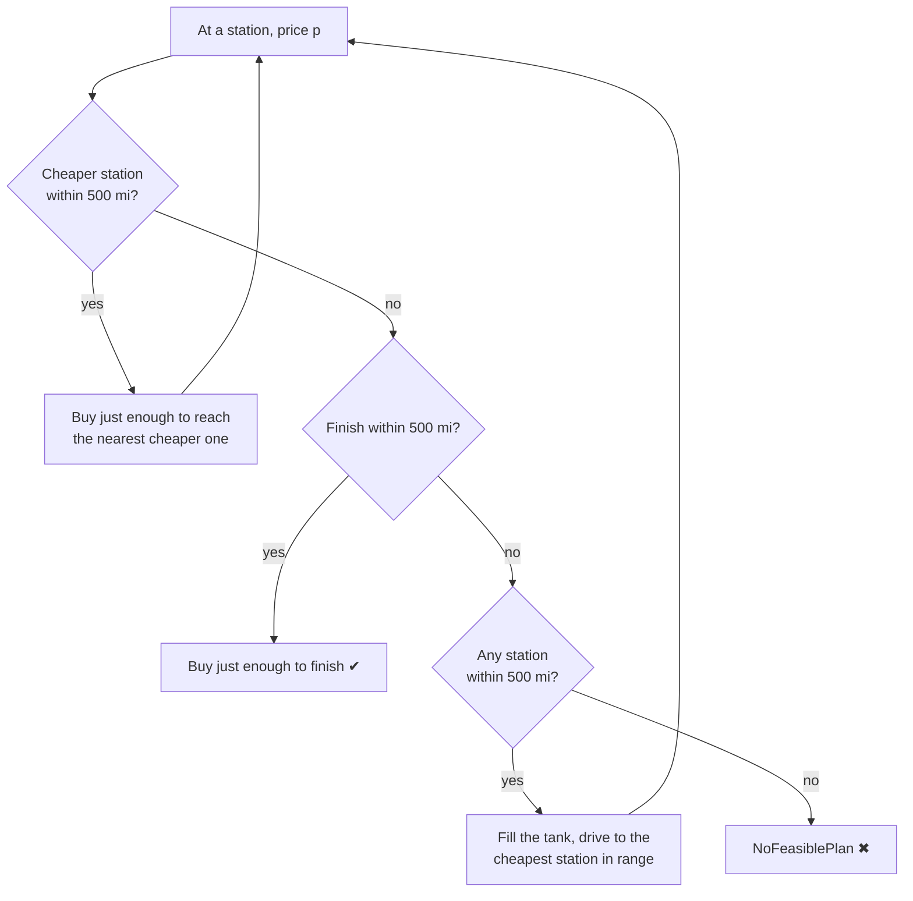

# Fuel Route API — Design Notes

Running record of the approach, decisions, alternatives considered and edge cases.
Updated at every step of the build; the final README is drawn from this file.

_Last updated: 30 Sep 2026 — Step 7 (starting fuel parameter and cost, response layout)_

---

## 1. The assignment

Build a Django API that takes a start and a finish location (both in the USA) and returns:

- the route, as a map
- the most cost-effective places to refuel along it — the vehicle's range is 500 miles, so long trips need several stops
- the total money spent on fuel, at 10 miles per gallon

Constraints: latest stable Django (6.1.1), fast responses, and few calls to the external map/routing API (1 is ideal, 2–3 acceptable). Fuel prices come from the provided CSV.

## 2. How the problem is interpreted

Two different problems could be meant:

| | Problem A — fixed route | Problem B — choose the route |
|---|---|---|
| Question | Where should the vehicle refuel along the normal driving route? | Which of all possible routes gives the lowest fuel bill? |
| Fits the brief? | Yes — "optimal location to fuel up **along the route**" | Not asked; needs many routing calls; ignores driving time |

**Decision:** Problem A is the core. A lightweight version of B is an optional bonus (D11) that still uses a single API call.

## 3. Solution overview

**One-time setup** — `python manage.py load_stations`

1. Read the fuel-price CSV and the place-name files (US Census Gazetteer, USGS GNIS, Natural Resources Canada).
2. Clean the CSV (dedupe, trim; Canada kept) and give every station coordinates from its City + State.
3. Insert stations and cities into the database (SQLite).

**Per request**

1. Resolve start and finish (e.g. `"Chicago, IL"`) to coordinates from the local `City` table — **0 API calls**.
2. **One** call to the OSRM routing API → route geometry (GeoJSON LineString), distance and duration.
3. Query the stations inside the route's bounding box (indexed), keep those within the corridor around the route line, and compute each one's mile marker along the route (Part A, D7).
4. Run the fuel-stop optimizer (Part B, D7), starting with the fuel the client says is in the tank (`start_fuel_percent`, default full — D8).
5. Charge the starting fuel used on the trip at the price of the station nearest to the start (D8).
6. Return JSON — summary and assumptions first, then starting fuel, fuel stops, and the route line last — plus an HTML map page for viewing.

**External API calls per request: 1.**

## 4. Data profile — `fuel-prices-for-be-assessment.csv`

| Metric | Value |
|---|---|
| Rows | 8,151 |
| Columns | OPIS Truckstop ID, Truckstop Name, Address, City, State, Rack ID, Retail Price |
| Latitude / longitude columns | None |
| Unique station IDs | 6,738 |
| Station IDs appearing more than once | 678 — same city/state every time, only the price differs |
| City values with trailing whitespace | 1,256 |
| Canadian rows (AB, BC, MB, NB, NS, ON, QC, SK, YT) | 620 |
| Unique US stations | 6,626 |
| Unique US city + state pairs | 3,813 |
| US stations whose address names a highway (I-, US-, SR-, HWY…) | 96.6% |
| US stations whose address gives an exit number | 56.4% |
| Price range (all rows) | $2.687 – $6.399 per gallon |

### Coordinate sources — Census Gazetteer (Places, County Subdivisions) + USGS GNIS Populated Places (measured)

| Metric | Value |
|---|---|
| Rows | 32,363 US places (incorporated places + census-designated places) |
| Format | Pipe-delimited (`|`); name in `NAME`, coordinates in `INTPTLAT` / `INTPTLONG` |
| Name format | Includes a type suffix — `Abbeville city`, `Abanda CDP`, `... town/village/borough` — stripped before matching |
| Same name twice in one state (after stripping) | 212 cases — why `City` has no unique constraint on (name, state) |
| Name normalisation for matching | lowercase, strip accents (Cañon → canon), drop spaces/punctuation (De Forest = DeForest), Saint/Fort/Mount → St/Ft/Mt, consolidated cities (Athens-Clarke County → Athens) |
| US stations placed — Places file only | 6,321 of 6,626 (95.4%) — misses concentrated in New England / mid-Atlantic townships, which the Census files as *county subdivisions* |
| County Subdivisions file added as a fallback (36,381 rows, same format; Places wins when both match) | **6,449 of 6,626 (97.3%)** |
| Still unmatched (177 stations, 133 city/state pairs) | Tiny unincorporated spots and postal names (e.g. Breezewood PA, Clines Corners NM, Jean NV) and neighbourhoods (Antioch TN). Skipped and listed by the loader |
| Pitfall found while testing | Strip the type suffix only once — stripping twice turned "Oklahoma City city" into "Oklahoma" |
| USGS GNIS "Populated Places" file added as third source (190,923 rows; includes unincorporated communities such as Breezewood PA, Jean NV; state given as FIPS code, mapped to USPS via the Census GEOID prefix) | 6,614 of 6,626 (99.8%) |
| Last 9 city names resolved with `data/city_aliases.csv`, each backed by the station's own address (e.g. Ottawa Lake MI, "US-23 EXIT 5" → Whiteford township; Willow Beach AZ, "US-93" → White Hills; Hot Springs National Park AR → Hot Springs) | **6,626 of 6,626 (100%)** |

**Canada:** NRCan Canadian Geographical Names Database, filtered to the 29,716 *Populated Place* entries and saved as `data/canada_populated_places.csv` (1.4 MB; the full 77 MB download is kept out of git). All 85 Canadian station towns match; 14 have duplicate names and use the Rack ID rule. **Total: 6,738 of 6,738 stations placed (6,626 US + 112 Canada).**

**Source priority:** Census Places → Census County Subdivisions → USGS GNIS → NRCan (Canada) → alias file applied first as a name translation.

**Ambiguous names** (same name more than once in a state — e.g. GNIS has 12 places called Antioch in Tennessee): pick the candidate nearest to the average position of other stations that share the same **Rack ID**. Rack ID is the OPIS wholesale fuel terminal a station's price is based on, so stations sharing a rack are in the same supply region. Spot checks: Antioch TN → Davidson County (Nashville), Chesterfield VA → Chesterfield County, Clear Brook VA → Frederick County (I-81).

## 5. Decisions

### D1. Routing provider — OSRM public server

| Option | API key | Alternative routes on long trips | Notes |
|---|---|---|---|
| **OSRM** (`router.project-osrm.org`) | No | Yes — requested count, not guaranteed | Max 1 request/second, non-commercial use, no uptime guarantee |
| OpenRouteService | Free key | No — alternatives only for trips under 100 km | Has fastest / shortest preference |
| Google Directions | Billing account | Yes | Not free |

**Chosen: OSRM.** Reviewers can run the project without signing up for anything, and it supports the bonus (D11).
OSRM returns the **fastest** route (least driving time), which is also what map apps return by default.

### D2. Start/finish geocoded locally

Routing APIs accept coordinates, not place names. The naive flow is 3 calls: geocode start, geocode finish, then route.
We resolve `"City, ST"` against the Census Gazetteer Places file (every US incorporated place and census-designated place, with a representative latitude/longitude), loaded once into a `City` table, so only the routing call remains.

- Trade-off: input must be `"City, ST"` (or raw coordinates).
- Possible extension: fall back to a geocoding API only when the local lookup fails — worst case 3 calls, still within the brief.

### D3. Station coordinates precomputed from City + State

The Address column holds highway exits (`I-44, EXIT 283 & US-69`), which street geocoders cannot resolve. Geocoding 3,813 city/state pairs through a free API would be slow and rate-limited.
Instead each station takes the coordinates of its town from the Census file, computed once at load time. Limitation and mitigations: E1, E2.

### D4. Data cleaning rules

- One row per OPIS ID, keeping the **lowest** price (the brief defines optimal as cost-effective).
- Trim whitespace in all text fields.
- Canadian rows are **kept** (revised). Start and finish are in the US, but some US-to-US routes run through Canada — Seattle → Anchorage uses the Alaska Highway through BC and Yukon (the CSV has stations in Dawson Creek, Fort Nelson, Watson Lake, Whitehorse), and Detroit → Buffalo is often fastest through Ontario. 620 rows = 112 stations in 85 towns. Their prices sit on the same per-gallon scale as US prices (median $4.45 vs $3.40), so they are used as given. Coordinates come from Natural Resources Canada's Canadian Geographical Names Database.
- Skip stations whose city is not in the Census file; the loader reports the count.

### D5. Storage

- SQLite file database (Django's default): zero setup for reviewers; switching to PostgreSQL is a settings change.
- Tables: `FuelStation` (index on latitude + longitude) and `City` (index on name + state; names stored lowercase).
- Stations store their own latitude/longitude instead of a foreign key to `City`: the corridor query reads one indexed table with no join, and station coordinates can later be replaced with exact positions (see Future improvements) without touching `City`.
- The loader is a Django management command, run once. At request time data is read through the ORM with a bounding-box query; the geometry and optimizer run in memory on that filtered list.

### D6. Price type

Stored as float; totals rounded to 2 decimals in the response. Prices are 8-decimal averages feeding an estimate, and mixing `Decimal` with float distance maths raises errors in Python.

### D7. The algorithm — Part A (stations along the route) and Part B (where to refuel)

The whole request reduces to two classic problems, solved one after the other:

```
   OSRM route: ~12,000 [lon, lat] points              FuelStation table: 6,738 stations
                      │                                            │
                      └──────────────────┬─────────────────────────┘
                                         ▼
   ┌─────────────────────────── PART A — corridor.py ───────────────────────────┐
   │  A1  Prefix sum   → give every route point a mile marker ("odometer")      │
   │  A2  Grid hashing → find the route point nearest to each station           │
   │  A3  Filter+sort  → keep stations ≤ 10 mi from the road, order by mile     │
   └────────────────────────────────────┬───────────────────────────────────────┘
                                        ▼
            [ (mile 0, $3.50), (mile 180, $3.20), (mile 420, $3.60), ... ]
                  a map problem has become a number-line problem
                                        ▼
   ┌───────────────────────── PART B — fuel_optimizer.py ───────────────────────┐
   │  Greedy (gas station problem) → where to stop, how many gallons, cost      │
   └────────────────────────────────────┬───────────────────────────────────────┘
                                        ▼
                     stops[ ], total_gallons, total_cost
```

**DSA summary**

| Step | Question | Technique | Why this technique |
|---|---|---|---|
| A1 | At which mile of the trip is each route point? | **Prefix sum** (running total) | One pass, O(n) |
| A2 | Which route point is closest to this station? | **Hash map / spatial hashing** (grid of 10-mile cells) | Checks only nearby points instead of all of them |
| A3 | In what order will the truck pass the stations? | **Sorting** by mile | Part B walks the road start → finish |
| B | Where to stop and how much to buy? | **Greedy** | Proven optimal for a fixed route; simple and fast |

#### Part A — which stations are on the route, and at which mile?

OSRM returns the route as a list of points plus one total distance. The database stores each station as a latitude/longitude. Neither says *"this station is at mile 312 of the trip"*, which is what Part B needs. Part A produces exactly that.

**A1. The odometer (prefix sum).** Walk the route points in order and keep a running total of the distance between consecutive points (haversine formula), just like a car's odometer:

```
Route points:   P0 ────── P1 ────────── P2 ─────────────── P3 ──────────── P4
Step (miles):        5            7                 8                6
Mile marker:    0          5              12                  20               26

                mile[i] = mile[i-1] + distance(P[i-1], P[i])      ← prefix sum
```

The route is thinned to about one point per mile first (fewer comparisons, still accurate to within a mile), and the measured total is scaled to match OSRM's reported distance.

**A2. The nearest route point: grid / hash map.** Each station takes the mile marker of the route point nearest to it, if that point is within 10 miles:

```
Station "Pilot"  → nearest route point is P3, 2 mi away   → Pilot is at mile 20       ✅ kept
Station "Joe's"  → nearest route point is 35 mi away      → not along this route      ❌ dropped
```

**Both sides of the road are covered.** From the truck's point of view, the truck is on the road and a station can be on its left or its right, up to 10 miles away on either side:

```
             LEFT side                          RIGHT side
     ⛽ ◄──────── 6 mi ────────  🚚 on the road  ──────── 4 mi ────────► ⛽
        ◄─────────── 10 mi ───────────►◄─────────── 10 mi ───────────►
```

The code checks the same thing from the **station's** side: *"is any point of the road within 10 miles of me?"* Distance is symmetric (station → road = road → station), so a station on the left and a station on the right are both found:

```
   Station on the LEFT:    ⛽ ──── 6 mi ────► road        ✅ found
   Station on the RIGHT:   road ◄──── 4 mi ──── ⛽        ✅ found
   Station far away:       ⛽ ────────── 35 mi ──────────► road   ❌ not along the route
```

Why ask from the station's side? The truck is not in one place. It moves along the whole road, so the same station would be seen from many road points (mile 19, 20, 21…). Asking from the station gives each station exactly one answer: *"the nearest road point is at mile 20, so I am at mile 20."*

**Making it fast: the grid (hash map).** Comparing every station with every road point gives the right answer but costs millions of distance calculations. Instead the map is cut into fixed **10 × 10-mile squares**, like a chessboard, and the road points are stored in a hash map by square: `HashMap<(column, row), [road points]>`.

Implementation detail: squares are defined in degrees, so every point maps to the same squares. Their east-west width is set at the route's northernmost latitude, where a degree of longitude is shortest, so no square is ever narrower than 10 miles.

For each station, look up **only the station's own square and the 8 squares around it**, a 3 × 3 window centred on that station. The window moves with each station, and every direction around it is included, so the road is found whichever side it is on:

```
   Road passes on the station's LEFT          Road passes on the station's RIGHT
   ┌────────┬────────┬────────┐              ┌────────┬────────┬────────┐
   │   •    │        │        │              │        │        │    •   │
   ├────────┼────────┼────────┤              ├────────┼────────┼────────┤
   │   •    │   ⛽   │        │              │        │   ⛽   │    •   │
   ├────────┼────────┼────────┤              ├────────┼────────┼────────┤
   │   •    │        │        │              │        │        │    •   │
   └────────┴────────┴────────┘              └────────┴────────┴────────┘
        ⛽ = station    • = road points       (same for road above, below or diagonal)
```

**Why the neighbouring squares, and why one ring is enough.** The squares are fixed on the map, and a station can sit anywhere inside its square, even right at an edge. A road point 3 miles away can then be in the next square:

```
   ┌──────────────────────┐
   │        • road point  │   ← square above: 3 mi from the station
   ├──────────⛽──────────┤   ← station sits on the edge of its own square
   │                      │
   │   station's square   │
   └──────────────────────┘
```

A square is 10 miles wide, so going 10 miles in any direction from the station can cross into the next square but never past it. One ring of neighbours therefore always covers the full 10 miles on every side.

The window can reach a little farther than 10 miles, depending on where the station sits. That is fine, because the window only gives **candidates**, and the exact distance decides:

```
   1. Collect road points from the 9 squares      → e.g. 25 points  (fast hash-map lookups)
   2. Measure the real distance to each           → 3 mi, 8 mi, 14 mi, 17 mi …
   3. Nearest one ≤ 10 mi?                        → yes: keep, take its mile  ✅   no: skip  ❌
```

If none of the 9 squares has a road point within 10 miles, the station is not along this route. We never search farther out, because a farther station would mean a large detour. **The result is identical to comparing every station with every road point, with far fewer calculations.**

Before any of this, a database query keeps only stations inside the route's bounding box (using the latitude/longitude index), so stations in far-away states are never loaded.

**A3. Two different distances: 10 miles sideways vs 500 miles along the road.**

```
                ◄──────────── 500 mi range: measured ALONG the road (Part B) ────────────►
   START ●━━━━━━━━━━━━━━━━━━━━━━━━━━━━━━━━━━━━━━━━━━━━━━━━━━━━━━━━━━━━━━━━━━━━━━━━━━━━━━━● FINISH
               ⛽ ↕ 3 mi                  ⛽ ↕ 8 mi                            ⛽
               kept                       kept                                ↕ 40 mi
                                                                              dropped
               ◄── ≤ 10 mi SIDEWAYS from the road (Part A) ──►
```

- **500 miles** = how far the truck can drive on one tank, counted along the road. Used in Part B.
- **10 miles** = how far off the road a station may be. It keeps detours small (the brief asks for stops *along the route*) and absorbs the town-centre approximation of station positions (E1). It is a constant (`CORRIDOR_MILES`) and easy to change.

**Output of Part A**: stations sorted by mile. The map is no longer needed:

```
mile:    0        180       420       560       850      1000
price:  $3.50    $3.20     $3.60     $3.00     $3.40    $3.80
```

#### Part B — where to stop and how much to buy (greedy)

Range 500 miles at 10 mpg → a 50-gallon tank.

**Leaving the start:** the start is not a station, so nothing can be bought there. The truck drives on the fuel it starts with (`start_fuel_percent`, D8) to a station within that range; if none is in range and the finish is not either, the result is `NoFeasiblePlan` ("the starting fuel is not enough – the first station is at mile X"). From the first station on, the rules below apply.

At each station the truck looks ahead 500 miles and applies the **first** situation that matches:

| # | Situation (looking 500 mi ahead) | What to do | Why |
|---|---|---|---|
| 1 | A **cheaper** station is within reach | Buy **only enough** to reach the nearest cheaper station | Never pay more for fuel that can be bought cheaper a little later |
| 2 | Nothing cheaper, but the **finish** is within reach | Buy **only enough** to finish | Fuel left in the tank at the end is wasted money |
| 3 | Nothing cheaper and the finish is out of reach | **Fill the tank**, then drive to the **cheapest** station within reach (on a tie, the farther one) | This is the cheapest fuel for the next 500 miles, so carry as much of it as possible |
| 4 | **No station** within reach at all | Stop with an error: `NoFeasiblePlan` ("no station within 500 miles after mile X") | The trip cannot be done on this range |



**In one line:** don't buy expensive fuel when cheaper fuel is ahead; buy the most where it is cheapest.

**Checked:** the optimizer matched a brute-force solver on 1,500 random trips (random stations, prices, tank sizes and starting fuel).

**Worked example** — 1,100-mile trip, starting with an empty tank at a station at mile 0 (`start_fuel_percent: 0`):

```
mile      0          180             420             560                  850           1000          1100
          ●━━━━━━━━━━━●━━━━━━━━━━━━━━━━○━━━━━━━━━━━━━━━●━━━━━━━━━━━━━━━━━━━━●━━━━━━━━━━━━━━○━━━━━━━━━━━━━◆
price   $3.50       $3.20           $3.60           $3.00                $3.40         $3.80        FINISH
buys    18 gal      38 gal          skip            50 gal (full)        4 gal         skip
tank on
arrival  —          0 gal            —              0 gal                21 gal          —           0 gal
```

| At mile | Price | Situation → decision | Bought | Cost |
|---|---|---|---|---|
| 0 | $3.50 | (1) Mile 180 is cheaper and in reach → buy for 180 mi | 18 gal | $63.00 |
| 180 | $3.20 | (1) Skip 420 ($3.60); mile 560 ($3.00) is cheaper → buy for 380 mi | 38 gal | $121.60 |
| 560 | $3.00 | (3) Nothing cheaper within 500 mi, finish is 540 mi away → fill up, go to the cheapest in reach (850) | 50 gal | $150.00 |
| 850 | $3.40 | (2) Arrive with 21 gal; finish 250 mi away, nothing cheaper → buy 4 gal | 4 gal | $13.60 |
| **Total** | | | **110 gal** (= 1,100 ÷ 10) | **$348.20** |

**Why greedy is safe here:** this is the *gas station problem*. For a fixed route, this greedy strategy is proven optimal (Khuller, Malekian & Mestre, *To Fill or Not to Fill*). Checked in practice: the implementation reproduces the example above and matched a brute-force dynamic-programming solver (tries every possible purchase plan) on 60 random trips.

### D8. Fuel in the tank at the start — optional parameter, full by default, and it is paid for *(decided, revised)*

**The email does not say how much fuel is in the tank at the start.** So the client can say it: the request takes an optional `start_fuel_percent` (0–100). If it is not sent, the tank is **full** (50 gal = 500 miles).

**Rule 1 — physics:** the truck can drive only as far as the fuel in its tank. It cannot buy anything until it reaches a station.

```
start_fuel_percent = 30  →  15 gal  →  150 miles of range

   START ●──────────────────── 150 mi ────────────────────┤ can reach
         ├─── 90 mi ───⛽ first station: reachable ✔
         ├──────────────────────── 210 mi ─────────⛽ first station: not reachable → 422
```

**Rule 2 — cost:** no fuel is free. The fuel in the tank at the start is charged at the price of the **station nearest to the start** (from the whole CSV, shown in the response as `starting_fuel.priced_at`). Only the part of it used on this trip is charged; whatever is left at the finish stays in the tank for the next trip.

```
Chicago → Houston, 1,083 mi, full tank (50 gal)
  starting fuel used   50.0 gal × price of the nearest station to Chicago
  bought on the way    58.3 gal at the stops the greedy algorithm picks
  total                108.3 gal = 1,083 ÷ 10   ✔ always miles ÷ 10

Trip of 200 mi, full tank
  starting fuel used   20 gal (30 gal left in the tank at the finish, not charged)
  bought on the way    0 gal
```

- If the starting fuel does not reach any station (or the finish), the API returns **422** ("starting fuel … is not enough – the first station is at mile …").
- Total gallons are always **miles ÷ 10**, so the answer is easy to check.
- The greedy algorithm is unchanged. The starting fuel is already in the tank, so the only choice is where to buy the rest; the gallons bought are always the same (miles ÷ 10 − starting fuel), and greedy picks the cheapest places for them. Checked against brute force on 1,500 random trips.
- `optimize: "cost"` compares routes on the total, starting fuel included.

**Why not the earlier versions** (kept here because the reasoning matters):

| Earlier approach | Problem |
|---|---|
| Tank empty, first fill "near the start" (nearest station within 25 mi counted as mile 0) | Inconsistent: the truck drives up to 25 miles (and, when the data has no station near the start, e.g. central LA, 250 miles to Jean, NV) on an "empty" tank |
| Tank empty, "Start fill" at mile 0 priced from a nearby station | Buys fuel at a place with no station in the data; still an invented purchase |
| Tank empty, strict | Almost every trip fails: stations sit at town centres, rarely exactly at the start point |
| Client sends `start_fuel_percent`, starting fuel not charged | The fuel in the tank looks free; a trip under 500 miles cost $0 |
| **Client sends `start_fuel_percent` (optional, default full); starting fuel used is charged at the nearest station's price** *(chosen)* | The physics is always consistent, nothing is free, and the client decides the starting state |

Note on data: the CSV is mostly highway truck stops, so a city start (e.g. central LA) can be far from the first station. With a full tank this is not a problem; with a very low `start_fuel_percent` the API correctly says the trip cannot start.

Response size: OSRM's full geometry has thousands of points. The corridor search uses all of them, but `route_geometry` in the response is cut to about one point per mile (the same odometer samples), which keeps Postman readable and the map looks the same.

### D9. Route representation

GeoJSON LineString; coordinates are **[longitude, latitude]**. OSRM distance is in metres (÷ 1,609.34 → miles), duration in seconds. Turn-by-turn steps are not requested — not needed for the brief, and it keeps the response small.

### D10. Map output

- In the JSON response: route line and stops as GeoJSON — viewable by pasting into geojson.io.
- `/api/map/?start=…&finish=…`: an HTML page drawing the route and fuel stops with Leaflet and OpenStreetMap tiles. The OSM tile server blocks requests that carry no Referer header, and Django's default Referrer-Policy (`same-origin`) strips it, so the page sets `strict-origin-when-cross-origin` for the tile requests. The API response links to it as `map_url`.
- OSRM results are cached for an hour (Django's in-memory cache), so opening the map after an API call, or repeating a request, makes no new routing call.

### D11. Bonus — optional `optimize` parameter

`time` (default) | `distance` | `cost`

One OSRM call requesting alternatives → run corridor + optimizer on each candidate → pick the minimum by the chosen key, using a selector map (Strategy pattern) rather than an if/else chain.

- OSRM does not guarantee alternatives; the response reports how many routes were compared.
- `distance` means the shortest *among the routes offered* — OSRM has no pure shortest-distance mode.
- `cost` compares the full fuel bill: starting fuel used (D8) plus fuel bought at the stops.

### D12. Code structure

```
routing/
  models.py                  FuelStation, City
  utils.py                   normalize() - shared name cleaning
  data_sources.py            readers for the CSV and the four place files
  management/commands/
    load_stations.py         one-time loader: match coordinates, save
  services/
    geocoding.py             "City, ST" -> coordinates (DB lookup, US only)
    osrm.py                  the single routing API call
    corridor.py              stations near the route + mile markers; nearest station to the start (prices the starting fuel)
    fuel_optimizer.py        greedy algorithm - pure logic, no Django/HTTP
    route_planner.py         orchestrates the services
  serializers.py             request validation
  views.py                   thin API view
```

SOLID applied the Python way: one reason to change per module; the optimizer takes and returns plain data (so it is unit-testable without a database or network); new `optimize` modes are new entries in a selector map. Plain functions and modules instead of Java-style interfaces - swapping the routing provider means replacing `osrm.py`.

## 6. Edge cases and limitations

| # | Case | Handling |
|---|---|---|
| E1 | Station placed at its town's centre, not its exact exit — may miss a station on the route, include one slightly off it, or shift its mile marker | Corridor of ~10 miles (configurable); mile marker taken from the nearest point on the route; optional range safety buffer (e.g. plan legs ≤ 480 mi). Worst case is a slightly costlier plan, not an infeasible one |
| E2 | Large cities: many stations share one point (Phoenix 22, San Antonio 19, Indianapolis 15) | Same mitigations as E1; the largest source of position error |
| E2b | Duplicate place names within a state | Disambiguated by Rack ID proximity (see coordinate sources) |
| E3 | Station's city not in any source | Resolved to 100% with three sources + a 9-row alias file; the loader still reports any future misses instead of failing |
| E4 | Canadian stations | Included — needed for US-to-US routes that cross Canada (Alaska Highway, Detroit–Buffalo via Ontario); placed with the NRCan Canadian Geographical Names file |
| E5 | Start/finish not found, wrong format, or outside the US | 400 with a clear message; 503 if OSRM is down |
| E6 | A stretch longer than 500 miles with no station in the corridor | `NoFeasiblePlan` error naming the mile where the gap starts |
| E7 | Trip under 500 miles | Full tank (default): no stop; the fuel used is charged at the nearest station's price. Lower `start_fuel_percent`: stops as needed (D8) |
| E8 | OSRM returns no alternatives | Compare whatever is returned (bonus mode) |
| E9 | OSRM public server limits | Documented; acceptable for an assessment |
| E10 | Starting fuel does not reach any station (e.g. `start_fuel_percent: 0`, or 10% from central LA where the first station is 250 miles away) | 422 with the mile of the first station, so the client knows how much fuel is needed |
| E11 | No station close to the start in the data (central LA: nearest is Coachella, 132 miles away) | Starting fuel is still priced at the nearest station; `starting_fuel.priced_at` shows which one and how far, so the reader can judge it |
| E12 | Starting fuel is more than the trip needs | Only the fuel used is charged; `starting_fuel.gallons_left_at_finish` shows what stays in the tank |

## 7. Future improvements

- Exact station coordinates: match highway + exit number against OpenStreetMap highway-exit data. Only the loader would change.
- Geocoding-API fallback for street addresses.
- Include detour distance when choosing a station.
- Shared cache (Redis) instead of the per-process in-memory cache.
- Let the client send the price paid for the fuel already in the tank, instead of using the nearest station's price.
- Spatial index for stations: the (latitude, longitude) B-tree index narrows the bounding-box query on latitude and filters longitude within it; a true spatial index (PostGIS / SQLite R*Tree) would be the production choice.

## 8. Build log

- **Step 1** — Django 6.1.1 project (`config`) with a `routing` app, Django REST Framework 3.18.1, Python 3.12 virtual environment.
- **Step 2** — `FuelStation` and `City` models; `load_stations` command: 6,738 stations placed (100%), including Canada; 208,112 place names; 84 duplicate names resolved by Rack ID.
- **Step 3** — `geocoding.py` (local "City, ST" lookup, US only) and `osrm.py` (the single routing call). Chicago → Houston: 1,083 mi, 19.9 h.
- **Step 4** — `corridor.py` (Part A) and `fuel_optimizer.py` (Part B), explained in D7. Optimizer matched a brute-force solver on 150 random trips.
- **Step 5** — `route_planner.py`, serializer, API view (`POST /api/route/`), map page (`/api/map/`), error codes 400/422/503, OSRM cache, bonus `optimize` modes.
- **Step 6** — tests (`python manage.py test routing`), README, Postman collection. Synthetic-route timings: 0.01–0.1 s per request excluding the OSRM call (Los Angeles → New York: 2,782 mi, 15 stops).
- **Step 7** — after running real trips: the GET variant of `/api/route/` removed (POST only, one way in); `route_geometry` in the response cut to about one point per mile; `assumptions` moved to the top of the response. Starting fuel reworked (D8): optional `start_fuel_percent` (default full), the truck can only drive as far as that fuel before its first stop (422 otherwise), and the starting fuel used is charged at the nearest station's price. 12 tests; optimizer re-checked against brute force on 1,500 random trips.

## References

- Khuller, Malekian, Mestre — [To Fill or Not to Fill: The Gas Station Problem](https://www.cs.umd.edu/projects/gas/gas-station.pdf)
- [OSRM API documentation](https://project-osrm.org/docs/v5.24.0/api/)
- [OSRM demo server usage policy](https://github.com/Project-OSRM/osrm-backend/wiki/Demo-server)
- [OpenRouteService API restrictions](https://openrouteservice.org/restrictions/)
- [US Census Gazetteer files](https://www.census.gov/geographies/reference-files/time-series/geo/gazetteer-files.html)
